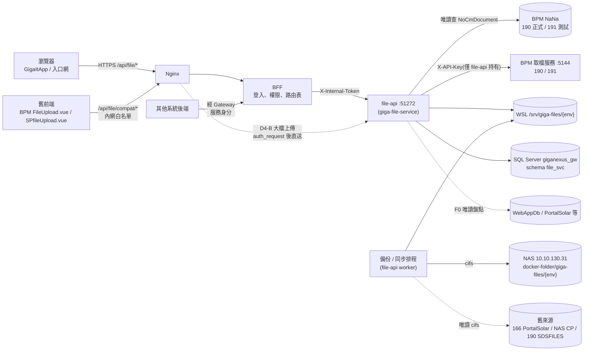
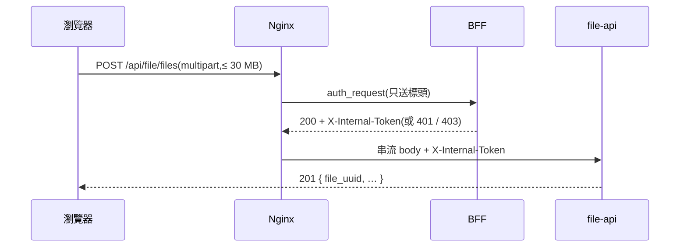

# GigaNexus 附件服務 — 整體架構

> 本文件自 [PRD.md](PRD.md) §6 拆出(原 FILE-PLAN §3.6、§5),為該主題的唯一維護來源;PRD 僅保留摘要與連結。
> 對應 PRD 版本:**v0.8**(2026-10-08)。Gateway 全域架構見 [Gateway ARCHITECTURE.md](../../giga-api-gateway-bff/docs/ARCHITECTURE.md)。

---

## 1. 架構總覽

| 元件 | 職責 | 文件 |
| --- | --- | --- |
| file-api | 上傳 / 下載 / 清單 / 綁定 / 軟刪除、BPM 附件代理、舊格式相容層、盤點查詢 | [API.md](API.md) |
| worker(同映像) | NAS 補傳、暫存檔清除、166 同步、NAS 備份拉取 | [STORAGE.md](STORAGE.md)、[MIGRATION.md](MIGRATION.md) |
| `giganexus_gw` schema `file_svc` | 檔案主表、操作紀錄、舊系統對照(與 Gateway 共用資料庫、不共用 schema) | [DATABASE.md](DATABASE.md) |
| WSL `/srv/giga-files/{env}` | 實體檔(UUID 命名) | [STORAGE.md](STORAGE.md) §1 |
| NAS `giga-files/` | 備份、166 原檔名鏡像 | [STORAGE.md](STORAGE.md) §2 |
| GigaItApp「Gateway 管理 › 檔案管理」 | 畫面(不在本 repo) | [PRD.md](PRD.md) §8 |

## 2. Gateway 現況限制與上傳路徑(D3、D4)

| 項目 | 現況 | 影響 |
| --- | --- | --- |
| BFF 動態路由轉發 | 請求 body **整個讀進記憶體**(Buffer)再轉上游,上限 10 MB(`router/plugin.ts`) | 大檔上傳會佔 BFF 記憶體;超過 10 MB 被拒 |
| Nginx | `client_max_body_size 10m`(`nginx.conf`) | 同上 |
| 下載 | BFF 以串流回傳上游 body | 不受影響 |
| 既有 multipart | `@fastify/multipart` 用於路由匯入、公告內文圖片(`/api/notify/assets`) | 公告圖片維持在 BFF,不搬 |

定案(D4-B):**上傳路由**由 Nginx `auth_request` 問 BFF 權限後**直接串流到 file-api**(同 `/ws/endpoint/*` 做法),只對上傳路由放寬到 31m(單檔 30 MB 加 multipart 表頭);**BFF 全域 10 MB 不動**。其餘 API(清單、下載、BPM)照一般路由經 BFF。

**已實作(2026-10-08)**:Gateway `nginx/conf.d/portal.conf` 的 `location = /api/file/files`(POST 直送、其他方法 `@api_via_bff`);BFF `/_auth/verify` 依已發佈的路由表檢查權限、簽出 aud = `file-api` 的內部 Token,並對非 GET 的原請求補驗 CSRF(Cookie 另有 SameSite=Strict)。直送的上傳不經 BFF 的路由層限流與稽核,由 file-api 的 `file_access_log` 記錄。相容路由內網白名單仍待 F7([DEPLOYMENT.md](DEPLOYMENT.md) §4)。

## 3. 關鍵架構決策

| 決策 | 內容 | 詳見 |
| --- | --- | --- |
| D1 | 新 repo,不放 BFF(BFF 不做業務邏輯、檔案 I/O 與 Gateway 隔離) | PRD §5 |
| D5 / D6 | WSL 檔案系統存放;NAS 排程補傳,不雙寫 | [STORAGE.md](STORAGE.md) |
| D8 / D9 | 舊表不動,`legacy_file_map` 對照;舊服務程式一律不改 | [MIGRATION.md](MIGRATION.md) |
| D10 / D11 | BPM 附件由 file-api 即時代理,5144 金鑰只在 file-api | [API.md](API.md) §3 |
| D15 | 新 API 與舊格式相容層網址分開 | [API.md](API.md) §4 |

## 4. 部署架構

- 部署比照其他服務:GitLab `develop` → 主機 2 測試區,`main` → 主機 3 正式區;容器加入 Gateway Docker 網路。細節見 [DEPLOYMENT.md](DEPLOYMENT.md)。
- 啟動時以 `@giganexus/backend-sdk` 自動註冊 API 草稿(BACKEND-GUIDE §7.5),並回報 giga-observe 監控(BACKEND-GUIDE §11)。
