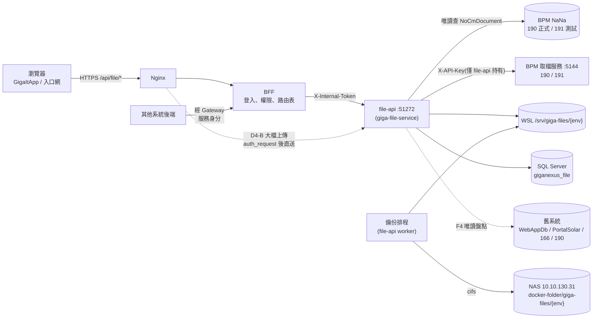
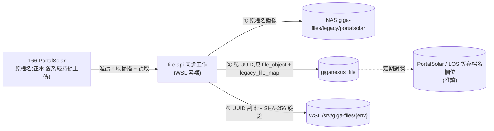

# GigaNexus — 附件服務計畫

> **時程以 NexusPlan 甘特圖為準**,本文不列日期。
> 相關文件:Gateway [BACKEND-GUIDE.md](../../giga-api-gateway-bff/docs/BACKEND-GUIDE.md) §2.1、§3、§4、[DEPLOYMENT.md](../../giga-api-gateway-bff/docs/DEPLOYMENT.md) §6(WSL2 Docker)、[FRONTEND-GUIDE.md](../../giga-api-gateway-bff/docs/FRONTEND-GUIDE.md) §7.5(畫面權限);GigaItApp `docs/UI-GUIDE.md`;舊系統 `GeneralBackend/filebackend`、`GeneralBackend/SMBbackend`、`old_PortalSolar`。

---

## 1. 文件資訊

| 項目 | 內容 |
| --- | --- |
| 文件版本 | v0.6(2026-10-08,納入 `smbFileUpload` 統計:§3.4 SMB 小節、相容層規則 12);v0.5(2026-10-08,納入 `webFileUpload` 依平台 / 應用統計:§3.4 觀察 6–9、相容層規則 10–11);v0.4(2026-10-08,納入 122 生產區 log 觀察:§3.4;相容層補規則 8、9);v0.3(2026-10-08,決策 D2–D12 定案:50 MB 走 Nginx 直送、DB 比照 Gateway、舊服務程式一律不動、166 PortalSolar 檔案經 NAS 同步成 UUID 副本(D14)、SMB 檔案改由 NAS 備份拉取(D9、D13)、BPM 權限第一版 `file.bpm.read`、新舊網址分開並提供舊格式相容層 `/api/file/compat/*`(D15、§8.3));v0.2(2026-10-07,納入 BPM 表單附件(Attachment):§3.5 現況、D10–D12、§8.2 API、§9 Tab、F6);v0.1(2026-10-07,初稿:舊系統盤點、架構與儲存建議、分階段工作項目;§4 多項待需求方確認) |
| 情境 | 各系統需要上傳附件(單據附件、證照、文件、圖片);舊做法分散在三套系統、命名與權限不一,PortalSolar 的檔案甚至可以不登入直接以網址下載 |
| 範圍 | 新服務 `file-api`(上傳 / 下載 / 清單 / 軟刪除 / 單據綁定);WSL 本機存放 + NAS 備份;GigaItApp「檔案管理」頁;舊系統盤點與 UUID 對照表;**BPM 表單附件唯讀查詢與下載**(經 190 / 191 既有取檔服務 :5144) |
| 不在範圍 | 舊系統的程式修改與檔案搬遷(F4 盤點後另行決策,§12 F5);**BPM 附件的上傳、修改、刪除**(附件仍由 BPM 系統管理);線上預覽 / 轉檔;版本控管(同一檔案多版本);防毒掃描(保留擴充點,§11) |

## 2. 目標

1. **一個共用附件服務**:各系統不再各自存檔,上傳後只保存 `file_uuid`。
2. **對外只用 UUID**:不暴露遞增 id、實體路徑或原檔名,下載一律經 Gateway 驗證身分與權限。
3. **檔案不遺失**:主機 WSL 存放,排程備份到 NAS,備份狀態可在畫面上查。
4. **舊系統先不動**:filebackend、SMBbackend、PortalSolar 照常運作;新服務提供盤點與對照,搬不搬之後一起決定。
5. **畫面可複製**:GigaItApp「檔案管理」先做,上傳元件之後給員工入口網與其他系統共用。

## 3. 現況盤點

### 3.1 GeneralBackend `filebackend`(:5124,過去主要的檔案後端)

| 項目 | 現況 |
| --- | --- |
| 存放 | 容器 `/usr/src/app/files/{SourcePlatform}/`,docker-compose bind mount 到主機 `./filebackend/files`;目前有 `BPM`、`CRM`、`ERP`、`MES` |
| 實體檔名 | `{uuid}{副檔名}`(multer diskStorage + `sanitize-filename`) |
| 資料表 | `WebAppDb.dbo.webFileUpload`(10.10.130.220);主鍵 `id INT IDENTITY` |
| 欄位 | `filename`、`originalName`、`filesize`、`mimetype`、`path`、`destination`、`Description`、`SourcePlatform`、`SourceApplication`、`SourceNumber`(來源單號)、`userAgent`、`userNumber`、`Effective`(軟刪除)、`storageType`、`ip`、`version`、`nasPath`、`uploadDate` |
| API | `/sql-upload`、`/sql-upload-multiple`、`/sql-files`、`/sql-files-by-source?sourceNumber=`、`/sql-download/:id`、`/sql-delete/:id`;另有不寫 DB 的 `/upload`、`/files/:platform/:filename` |
| 問題 | 下載以**遞增整數 id**,可被逐號猜測;無登入驗證(靠內網);`nasPath` 欄位有定義但沒有實際備份流程 |

### 3.2 GeneralBackend `SMBbackend`(:5125)

| 項目 | 現況 |
| --- | --- |
| 由來 | 原本以 SMB 連 166 主機(舊員工入口網)目錄;需求方要求放到新主機後改為本機存放,SMB 設定只保留未使用 |
| 存放 | 容器 `/usr/src/app/files/{使用者自訂路徑}/`;multer memoryStorage,上限 100 MB |
| 實體檔名 | `/db/upload` 為 `{uuid}{副檔名}`;**從舊主機搬來的檔案仍是中文原檔名**(例 `電子發票設定.docx`) |
| 資料表 | `WebAppDb.dbo.smbFileUpload`,**欄位與 `webFileUpload` 完全相同,但為不同資料表** |
| 差異 | `path` 意義不同:filebackend 是「平台 / uuid」,SMB 是「使用者選的目錄 / uuid」,並提供目錄瀏覽(`/files`)與依路徑下載 |
| 問題 | `localdownload` 以 `path.join(localFilesPath, 參數)` 取檔,**未檢查 `../`**,可讀到 files 目錄以外的容器檔案;找不到時還會以檔名在整個目錄樹搜尋(同名檔可能拿錯) |

### 3.3 old_PortalSolar(ASP.NET WebForms,166 主機)

實體檔案以**原檔名**存在 `D:\WWW\PortalSolar\` 下(UNC `\\10.10.130.166\PortalSolar\`),資料庫只存檔名;下載是**不需登入**的公開網址。程式碼中找到的存檔位置:

| 目錄 | 用途 | 程式 | 資料庫存法 |
| --- | --- | --- | --- |
| `EHS\License` | 環安證照 | `EHS/EHLicense`、`EHS/EHItemEdit` | 檔名;**同名直接覆蓋** |
| `PropertyFile` | 部門 / 個人財產照片 | `DeptPropertyInfo`、`PersonalPropertyInfo`、`GAffairs` | `PicFile`(檔名) |
| `Document` | 行事曆 PDF、TV 輪播圖、代理人名單 | `Schedule`、`TVDemo`、`TVDemoSetting`、`HR` | `ImgPath`;同名加 `_n` |
| `PersonalPic`、`PearsonPic` | 員工照片(工號.jpg) | `ExtensionTable`、`HRPromoteMap` | 不存 DB,以工號組檔名 |
| `html` | 公告內容 | `html/PublicContentX` | — |
| `EIP` | 同意書簽名圖 | `Consent8`、`GSCConsentX`、`GSMCConsentX` | — |
| QA 附件 | 問卷題目附件 | `QA/QuestSetting` | — |
| `ESLearning`(166 網站根) | 教育訓練影片 mp4 | `ES_ELearning` | 下拉選單值組路徑 |
| **`SDSFILES`(10.10.130.190)** | 化學品安全資料表 | `EHS/EHCHEMICALInfo` | `physicalName` + `extentionName`(與 BPM `NoCmDocument` 同樣的欄位命名,**推測為 BPM 附件**,見 §3.5,待確認) |

- 涉及資料庫:`PortalSolar`、`Budget`、`LOS`、`LearnDB`、`MBO`,分布在 10.10.10.174、10.10.130.190、10.10.130.220。
- 以上只來自程式碼搜尋,**實際目錄與檔案數量需 F0 盤點確認**(可能還有程式未引用的目錄)。

### 3.4 舊服務實際使用情形(122 生產區 log)

來源:122 主機 `D:\GeneralBackend\filebackend\logs\`(`error.log`、`file-upload.log` 最後修改 2026-08-04、輪替檔 `file-upload1.log` 最後修改 2026-10-05)。每行一筆 JSON(winston),欄位:`ip`、`method`、`url`、`userAgent`、`message`、`timestamp`;下載另有 `id`、`filename`、`originalName`、`platform`、`size`。範例:

```json
{"ip":"::ffff:172.19.0.1","message":"GET /sql-download/140","method":"GET","url":"/sql-download/140","userAgent":"Mozilla/5.0 … Chrome/150.0.0.0 Safari/537.36","timestamp":"2026-08-04T08:58:44.780Z"}
{"id":140,"filename":"5aab33ac-7d26-482d-9abc-3159ee49f887.png","originalName":"20260312-KQ09.png","platform":"BPM","message":"SQL 檔案下載","size":34892}
{"count":66,"returned":50,"platform":"all","message":"從資料庫檢索檔案列表"}
```

觀察:

1. **仍在使用**:最新輪替檔在 2026-10-05 仍有寫入。
2. **呼叫者是瀏覽器**(`userAgent` 為 Chrome),從使用者電腦直接呼叫 `122:5124`,主要是 `GET /sql-files` 與 `GET /sql-download/{id}`,和 BPM `FileUpload.vue` 的行為一致。
3. **看不到真實來源 IP**:`ip` 一律是 Docker 橋接閘道(`::ffff:172.19.0.1`),不能用 IP 判斷誰在用。要判斷哪些平台 / 應用還在用,改查資料庫 `webFileUpload` 的 `SourcePlatform`、`SourceApplication`、`userNumber` 與最近上傳時間(F0)。
4. **`/sql-files` 的既有缺陷**:前端不帶參數(`platform:"all"`),後端預設只回 50 筆;log 顯示 `count: 66, returned: 50`。`FileUpload.vue` 拿到這 50 筆後才在前端依 `sourceNumber` 篩選,所以**有效檔超過 50 筆之後,較舊單據的附件在畫面上就查不到**。相容層需處理(§8.3 規則 8)。
5. **量體很小**:2026-08-04 有效檔 66 筆、`id` 至少到 140(含已刪除);filebackend 的搬遷量小,不需要分批。

**`webFileUpload` 依平台 / 應用統計**(2026-10-08 於 122 生產區查詢;`SourcePlatform`、`SourceApplication`、筆數、有效筆數、最近上傳)。`SourceApplication` 的格式是 `{應用}_{類別}`(`FileUpload.vue` 以網址參數 `sourceApplication` 加 `class` 組成):

| 應用 | 類別(筆數 / 有效) | 合計 | 有效 | 最近上傳 |
| --- | --- | --- | --- | --- |
| 太陽能ECRECN | 內容說明(BPM 46 / 28、OTHER 11 / 9)、規格(BPM 6 / 4) | 63 | 41 | 2026-10-01 |
| 特用膠材ECRECN | 內容說明(BPM 18 / 17、OTHER 2 / 1)、規格(BPM 4 / 4、OTHER 1 / 1)、其他(BPM 4 / 4) | 29 | 27 | 2026-08-05 |
| SpecialGlueApprovalDocs(OTHER) | PPAP(5 / 5)、客戶回簽(9 / 5)、承認書(6 / 0) | 20 | 10 | 2026-08-28 |
| 碩禾ECRECN會簽系統 | 內容說明(7 / 7)、規格(3 / 3) | 10 | 10 | 2026-05-07 |
| MIS反應單 | User上傳(5 / 1)、User資料(2 / 0)、報修單(2 / 1)、測試(4 / 0)、測試_User上傳(2 / 0) | 15 | 2 | 2025-09-04 |
| NotesApp / Notes / NoteAPp | NotesApp_碩禾特用膠材ECRECN(5 / 5)、…_User資料(1 / 1)、Notes(1 / 1)、NoteAPp(1 / 1) | 8 | 8 | 2025-10-09 |
| BPM_測試(OTHER) | — | 6 | 5 | 2025-09-04 |
| **合計** | | **151** | **103** | |

6. **只有 `BPM`、`OTHER` 兩種平台**:`CRM`、`ERP`、`MES` 在資料庫裡沒有任何資料列(`files/` 下雖有同名目錄,F0 要確認是否為測試檔或孤兒檔)。`platform` 由呼叫端的網址參數決定,同一個應用(例如 `太陽能ECRECN_內容說明`)同時出現 `BPM` 與 `OTHER`,**搬遷與相容層都不正規化**,照原值保留。
7. **呼叫者全部是 BPM 表單**:ECR / ECN(工程變更)系列三套、特用膠材承認書(`SpecialGlueApprovalDocs`)、MIS 反應單、NotesApp,皆經 `FileUpload.vue`;沒有其他系統的資料列。最近的上傳是 2026-10-01(`太陽能ECRECN_內容說明`),使用中;`MIS反應單`、`NotesApp` 最近上傳停在 2025-09 / 10,疑似已停用。
8. **`SourceApplication` 不要拆**:`_` 之後是類別,但名稱本身也可能含 `_`(例 `MIS反應單_測試_User上傳`),無法可靠地拆回「應用」與「類別」。新服務 `source_app` 存**完整字串**,相容層原樣回傳。
9. **測試與已刪除資料**:`*_測試`、`BPM_測試`、`承認書`(有效 0 筆)等是測試或已全數刪除的資料,F0 搬遷時以 `Effective` 為準,測試資料是否搬由需求方決定(預設只搬 `Effective = 1`,其餘只留對照紀錄)。


**SMBbackend(`smbFileUpload`)統計**(2026-10-08 於 122 生產區查詢):

| `SourcePlatform` | `SourceApplication` | `destination` | 筆數 | 有效 | UUID 檔名 | 其他檔名 | 最近上傳 |
| --- | --- | --- | --- | --- | --- | --- | --- |
| Web | BPM系統 | 根目錄 | 83 | 54 | 8 | 75 | 2026-10-07 18:31 |

- **只有一個呼叫者**:全部是 `Web` / `BPM系統`,即 BPM `SPfileUpload.vue`;最近上傳在 2026-10-07,使用中。
- **全部放在根目錄**:沒有任何子目錄(`destination` 全為「根目錄」),所以 SMB 的目錄瀏覽 / 自訂路徑功能實際上沒有被使用,`path` 就等於實體檔名。
- **檔名**:只有 8 筆是 `{uuid}{副檔名}`,**75 筆不是**(推測為舊主機搬來、或 UUID 機制上線前上傳的中文原檔名,F0 以 NAS `CP` 實際檔案確認)。這 75 筆的 `path` 就是原檔名,舊前端用它下載與刪除,相容層必須查得到(§8.3 規則 12)。
- **量體很小**(83 筆,有效 54 筆),可一次完成。有效筆數 × 檔名類型的交叉、以及這 83 筆在 NAS `CP` 是否都有實體檔,待 F0。

兩個舊服務合計:**234 筆,有效 157 筆**,皆為 BPM 表單附件。

### 3.5 BPM 表單附件(Attachment)

BPM(NaNa)的表單附件由 BPM 系統自己存放;需求方已在 BPM 主機架設取檔服務,另有 `D:\檔案分享\程式碼\BPM\BPMbackend`(:5149)提供查詢與轉發下載。

| 項目 | 現況 |
| --- | --- |
| 主機 | 正式區 **10.10.130.190**、測試區 **10.10.130.191**;資料庫皆為 `NaNa` |
| 附件資料 | `NoCmDocument`:`OID`(Doid)、`logicalName`(中文原檔名)、`physicalName`(加密檔名,例 `x5491d50x140f277331dx1005`)、`extentionName`、`formInstanceOID` |
| 與表單的關聯 | `ProcessInstance.serialNumber`(單號)→ `LocalRelevantData` → `FormInstance` → `NoCmDocument.formInstanceOID` |
| 路徑索引 | `NaNa.dbo.localAttachmentPath`:`fileName`(= physicalName,PK)、`fileWholeName`、`fileType`、`filePath`、`URL`、`fileCreation`;查詢時 LEFT JOIN,**目前下載邏輯沒有使用它** |
| 取檔服務 | `http://{190 / 191}:5144/download/{目錄}/{physicalName}{副檔名}`,標頭 `X-API-Key` |
| 目錄規則 | physicalName 每 2 字元切段、去掉第 1 段後**反向**組成目錄;段數不固定,BPMbackend 依序嘗試 11 → 10 → 12 段,前一次回 `File not found` 才試下一個 |
| BPMbackend API | `/attachment/serialNumber/:serialNumber`、`/attachment/physicalName/:physicalName`、`/attachment/download/:Doid`、`/attachment/url/:Doid`;`/test/attachment/*` 對應測試區 |

問題:

1. **X-API-Key 由呼叫端帶入、BPMbackend 原樣轉送**,等於呼叫 BPMbackend 的一方要持有 5144 的金鑰;且金鑰明碼寫在 `AttachmentController.js` 註解並已進 git,**建議更換金鑰**。
2. 依單號查詢用 `LIKE '%單號%'`,部分字串會比對到其他表單的附件。
3. 最多打 3 次 5144 才找到檔案;`localAttachmentPath.filePath` 若完整,可直接取得路徑。
4. 下載的 `Content-Disposition` 只有 `filename="%E4..."`,部分瀏覽器中文檔名會顯示成編碼字串。
5. 沒有使用者身分與權限檢查:知道 Doid 就能下載任何表單的附件。

### 3.6 Gateway 現況限制

| 項目 | 現況 | 影響 |
| --- | --- | --- |
| BFF 動態路由轉發 | 請求 body **整個讀進記憶體**(Buffer)再轉上游,上限 10 MB(`router/plugin.ts`) | 大檔上傳會佔 BFF 記憶體;超過 10 MB 被拒 |
| Nginx | `client_max_body_size 10m`(`nginx.conf`) | 同上 |
| 下載 | BFF 以串流回傳上游 body | 不受影響 |
| 既有 multipart | `@fastify/multipart` 用於路由匯入、公告內文圖片(`/api/notify/assets`) | 公告圖片維持在 BFF,不搬 |

## 4. 決策

| # | 問題 | 建議 | 狀態 |
| --- | --- | --- | --- |
| D1 | 放在 BFF 還是新 repo | **新 repo `giga-file-service`**。理由:BACKEND-GUIDE §2.1 BFF 不做業務邏輯;檔案 I/O 與 Gateway 隔離;§3.2 已將 51270–51279 留給「共用服務(公告、檔案等)」 | ✅ 定案(新 repo) |
| D2 | 服務代碼 / port | `file-api` / **51272**(51271 為 portal-api);系統代碼 `file`,API `/api/file/*` | ✅ 定案;實作時登記 BACKEND-GUIDE §3.3 |
| D3 | 單檔大小上限 | **50 MB**(≤ 10 MB 可直接經 BFF,更大走 D4-B) | ✅ 定案 |
| D4 | 大檔上傳路徑 | (A)只對上傳路由調高 BFF / Nginx 上限,仍經 BFF 緩衝;(B)上傳改由 Nginx `auth_request` 問 BFF 權限後**直接串流到 file-api**(同 `/ws/endpoint/*` 做法)。上限 > 50 MB 建議 B | ✅ 定案 **B**:Nginx 只對上傳路由放寬到 50 MB 並直送 file-api;BFF 全域 10 MB 不動 |
| D5 | 檔案存放位置 | WSL 檔案系統 `/srv/giga-files/{env}`(bind mount 進容器);**不放 `/mnt/c`**(跨 9P 慢、權限 / symlink 問題)。Windows 需要看時用 `\\wsl$\<發行版>\srv\giga-files` | ✅ 採用 |
| D6 | NAS 備份方式 | WSL 以 cifs 掛載 `\\10.10.130.31\docker-folder`,**排程補傳**(非上傳同時雙寫),DB 記錄備份狀態;路徑 `giga-files/{env}/` | 建議;✅ 採用;子目錄與服務帳號待 IT 提供(F2 前需要) |
| D7 | 資料庫 | 10.10.130.220 新建 `giganexus_file`(正式)/ `giganexus_file_test`(測試 + 開發),帳號比照 Gateway 分 app / migrate | ✅ 定案(建庫與帳密由使用者執行) |
| D8 | 舊系統 UUID | **新服務建對照表 `legacy_file_map`,不改舊資料表**(PortalSolar 檔名散在多個 DB / 表);filebackend、SMB 兩張表若要直接加 `FileUuid UNIQUEIDENTIFIER DEFAULT NEWID()` 也可,另議 | ✅ 採用對照表;逐系統去留 F4 盤點後決策 |
| D9 | 舊服務 | 照常運作、**程式碼一律不修改**(含 SMB `localdownload` 路徑問題,§3.2 僅記錄) | ✅ 定案:不動舊 repo;風險靠「新服務上線後舊服務下線」處理 |
| D10 | BPM 附件怎麼接 | **file-api 直接查 NaNa(唯讀帳號)並向 5144 取檔、串流回傳**,不經 BPMbackend;5144 金鑰只放 file-api 機密設定,瀏覽器與其他系統拿不到。環境對應:測試區 → 191、正式區 → 190 | ✅ 採用 |
| D11 | BPM 附件要不要複製一份到新服務 | **先不複製**(即時代理);若 5144 不穩或需要長期保存,再改為「第一次下載時快取到 WSL 並寫 `legacy_file_map`」 | ✅ 採用 |
| D12 | BPM 附件的權限 | 第一版:有 `file.bpm.read` 的人可依單號查詢 / 下載;之後視需求加「只能看自己是申請人或簽核人的表單」(需查 BPM 的 WorkItem / 簽核紀錄) | ✅ 定案:第一版僅 `file.bpm.read`,限申請人 / 簽核人列為後續 |
| D13 | 舊檔怎麼進新服務 | **從 NAS 備份拉取**(SMB → `CP`、filebackend → `docker-folder` 各平台目錄),唯讀掛載、先乾跑對照 DB、再複製;不碰 122 主機與舊程式。細節見 §10.1 | ✅ 定案(方向);NAS 唯讀帳號與備份頻率待確認 |
| D15 | 新舊服務網址 | **分開**:新 API 為 `/api/file/files*`、`/api/file/bpm/*`;舊格式相容層為 `/api/file/compat/{fb\|smb\|portal}/*`(路徑與 JSON 照舊,舊前端只換基底網址);盤點結果改為 `/api/file/inventory/*`。細節見 §8.3 | ✅ 定案(方向);舊端點使用者清單待 F0 確認 |
| D14 | 166 PortalSolar 怎麼處理 | **166 → NAS(原檔名鏡像)→ 配 UUID → WSL(UUID 副本)**;對照表新建、舊表不動;並行期間 166 為正本,每日增量單向同步;同名被覆蓋時保留舊版(舊列 `is_current = 0`)。細節見 §10.2 | ✅ 定案(方向);掃描範圍待 F0;覆蓋處理與頻率為建議值 |

## 5. 架構



- 部署比照其他服務:GitLab `develop` → 主機 2 測試區,`main` → 主機 3 正式區;容器加入 Gateway Docker 網路。
- 啟動時以 `@giganexus/backend-sdk` 自動註冊 API 草稿(BACKEND-GUIDE §7.5),並回報 giga-observe 監控。

## 6. 儲存設計

### 6.1 本機(WSL)

| 項目 | 設計 |
| --- | --- |
| 根目錄 | `/srv/giga-files/{env}`(env = `test` / `prod`),容器內固定 `/data/files` |
| 實體路徑 | `{yyyy}/{mm}/{file_uuid}`(**不帶副檔名、不帶原檔名**),避免單一目錄檔案過多,也避免依副檔名被執行 |
| 寫入 | 先寫 `tmp/` 並同時計算 SHA-256,完成後 rename 到正式路徑再寫 DB;失敗清掉暫存 |
| 容量 | WSL 虛擬磁碟(`ext4.vhdx`)預設在 C 槽且只增不減:建議搬到 D 槽或於 `.wslconfig` 設上限;容量用量顯示於 §9 Tab 3 |

### 6.2 NAS 備份

| 項目 | 設計 |
| --- | --- |
| 掛載 | WSL 以 cifs 掛載 `//10.10.130.31/docker-folder` 到 `/mnt/nas-docker`,帳密放 credentials 檔(權限 600);**帳密腳本由使用者執行**,AI 不經手 |
| 時機 | 排程每 N 分鐘掃 `backup_status = pending` 補傳;NAS 斷線時上傳不受影響,恢復後自動補 |
| 驗證 | 複製後比對 SHA-256,成功寫 `backup_status = done`、`backup_at`;失敗累計次數,超過門檻告警(Email 經 Gateway `/api/notify/send`) |
| 刪除 | 軟刪除不動 NAS;實體清除(保留期限後)才同步刪 NAS,保留期限待定 |
| 還原 | 提供 CLI:依 DB 紀錄從 NAS 拉回遺失的實體檔 |

## 7. 資料庫設計(草案)

```sql
-- 檔案主表
file_object (
  id              BIGINT IDENTITY PRIMARY KEY,   -- 內部用,不對外
  file_uuid       UNIQUEIDENTIFIER NOT NULL UNIQUE,  -- 對外唯一識別
  original_name   NVARCHAR(255) NOT NULL,
  ext             NVARCHAR(20),
  mime            NVARCHAR(100),
  size_bytes      BIGINT NOT NULL,
  sha256          CHAR(64) NOT NULL,
  storage_key     NVARCHAR(200) NOT NULL,       -- {yyyy}/{mm}/{uuid}
  source_system   NVARCHAR(50) NOT NULL,        -- 例 it / portal / bpm(對應 Gateway 系統代碼)
  source_app      NVARCHAR(50),
  ref_type        NVARCHAR(50),                 -- 單據類型
  ref_no          NVARCHAR(100),                -- 來源單號;NULL = 尚未綁定(暫存)
  company_id      NVARCHAR(20),
  uploaded_by     NVARCHAR(20) NOT NULL,        -- 工號
  uploaded_ip     NVARCHAR(50),
  created_at      DATETIME2 NOT NULL,
  bound_at        DATETIME2,
  deleted_at      DATETIME2,                    -- 軟刪除
  deleted_by      NVARCHAR(20),
  backup_status   NVARCHAR(10) NOT NULL,        -- pending / done / failed
  backup_at       DATETIME2,
  backup_attempts INT NOT NULL DEFAULT 0
)

-- 操作紀錄(上傳 / 下載 / 刪除 / 綁定)
file_access_log (id, file_uuid, action, user_id, ip, request_id, created_at)

-- 舊系統對照(F4)
legacy_file_map (
  id              BIGINT IDENTITY PRIMARY KEY,
  file_uuid       UNIQUEIDENTIFIER NOT NULL UNIQUE,  -- 同 file_object.file_uuid
  legacy_source   NVARCHAR(30) NOT NULL,   -- portalsolar / smbbackend / filebackend / sdsfiles
  legacy_dir      NVARCHAR(300),           -- 相對來源根目錄的目錄,例 EHS\License
  legacy_name     NVARCHAR(255) NOT NULL,  -- 原檔名(中文照存)
  legacy_db       NVARCHAR(100),           -- 以下三欄 F0 盤點後回填:哪個資料列引用這個檔
  legacy_table    NVARCHAR(100),
  legacy_key      NVARCHAR(200),
  size_bytes      BIGINT NOT NULL,
  mtime_utc       DATETIME2 NOT NULL,      -- 來源檔修改時間,判斷是否變動
  sha256          CHAR(64),
  is_current      BIT NOT NULL DEFAULT 1,  -- 同名內容被覆蓋時,舊列設 0、新增一列(新 UUID)
  nas_path        NVARCHAR(500),           -- NAS 原檔名鏡像位置
  nas_copied_at   DATETIME2,
  wsl_copied_at   DATETIME2,               -- UUID 副本寫入 WSL 的時間
  first_seen_at   DATETIME2 NOT NULL,
  last_seen_at    DATETIME2 NOT NULL,
  source_missing_at DATETIME2,             -- 來源已不存在(只標記,不刪 NAS / WSL)
  sync_state      NVARCHAR(20) NOT NULL    -- discovered / nas_copied / done / failed
)
-- 唯一鍵:(legacy_source, legacy_dir, legacy_name) WHERE is_current = 1
```
- 每個被同步的舊檔也會有一筆 `file_object`(`source_system` 標示舊系統),讓新舊檔案都用同一支 `/api/file/files/:uuid/content` 下載。
- 舊資料表不動:舊程式存的「檔名」要找對應 UUID,用 `(legacy_source, legacy_dir, legacy_name, is_current = 1)` 查本表。

- SQL Server 2012 支援 `UNIQUEIDENTIFIER` / `NEWID()`;UUID 由應用端產生(v4),不依賴 DB。
- `DATETIME2` 存 UTC,畫面轉台灣時間(比照 Gateway)。

## 8. API(草案)

### 8.1 新服務檔案

所有 API 經 Gateway `/api/file/*`,權限由 BFF 依 `x-permission` 檢查;file-api 只做資料層級過濾(BACKEND-GUIDE §4)。

| 方法 | 路徑 | 說明 | 權限 |
| --- | --- | --- | --- |
| POST | `/api/file/files` | 上傳(multipart `file`,可多檔;選填 `sourceApp`、`refType`、`refNo`) | `file.object.upload` |
| GET | `/api/file/files` | 清單(篩選來源系統、單號、上傳者、日期;分頁) | `file.object.read` |
| GET | `/api/file/files/:uuid` | 檔案資訊 | `file.object.read` |
| GET | `/api/file/files/:uuid/content` | 下載(`Content-Disposition` 含 UTF-8 檔名;`?inline=1` 預覽圖片 / PDF) | `file.object.read` |
| POST | `/api/file/files/bind` | 將暫存檔綁定到單據(`uuids[]`、`refType`、`refNo`) | `file.object.upload` |
| DELETE | `/api/file/files/:uuid` | 軟刪除 | `file.object.delete` |
| GET | `/api/file/storage` | 容量、備份統計、失敗清單 | `file.storage.read` |
| POST | `/api/file/storage/backup/retry` | 重試失敗的備份 | `file.storage.manage` |
| GET | `/api/file/inventory/*` | 舊系統盤點結果(唯讀) | `file.legacy.read` |
| GET | `/healthz`、`/openapi.json` | 健康檢查、Gateway 匯入 | 內網 |

**上傳兩段式(建議)**:畫面先上傳拿到 `file_uuid`(此時 `ref_no` 為空,屬暫存),單據存檔時再呼叫 `bind`;超過 24 小時未綁定的暫存檔由排程清除。避免「單據沒存成、檔案留下垃圾」。

### 8.2 BPM 附件(唯讀)

| 方法 | 路徑 | 說明 | 權限 |
| --- | --- | --- | --- |
| GET | `/api/file/bpm/forms/:serialNumber/attachments` | 依單號**完全比對**列出附件(Doid、原檔名、副檔名、表單名稱、主旨、建立日期) | `file.bpm.read` |
| GET | `/api/file/bpm/attachments/:doid` | 單一附件資訊 | `file.bpm.read` |
| GET | `/api/file/bpm/attachments/:doid/content` | 下載:先用 `localAttachmentPath.filePath`,沒有才依 §3.5 目錄規則(11 → 10 → 12 段)向 5144 取檔;串流回傳,`filename*=UTF-8''` 中文檔名 | `file.bpm.read` |

- 環境由 file-api 設定決定(`BPM_ENV`),**不提供** `/test/*` 這類以路徑切換正式 / 測試的 API。
- 每次下載寫 `file_access_log`(`action = bpm_download`,記 Doid 與單號)。
- 找到正確的目錄段數後記在快取(Redis 或記憶體 LRU,key = physicalName),同一檔案不重複試。

### 8.3 舊格式相容層(`/api/file/compat/*`,D15)

新舊 API 的網址**分開**:`/api/file/files*`、`/api/file/bpm/*` 是新 API(§8.1、§8.2,UUID、Gateway 統一格式);`/api/file/compat/{fb|smb|portal}/*` 是**舊格式相容層**,路徑與 JSON 照舊服務原樣,讓舊前端只換「基底網址」就能改打新服務。相容層是過渡用,舊前端都切換後下線。

| 舊服務 | 舊基底網址 | 相容層基底網址 | 舊前端 |
| --- | --- | --- | --- |
| GeneralBackend `filebackend` | `http://10.10.130.122:5124` | `https://<gateway>/api/file/compat/fb` | BPM `bpmcomonent/FileUpload.vue` |
| GeneralBackend `SMBbackend` | `http://10.10.130.122:5125` | `https://<gateway>/api/file/compat/smb` | BPM `bpmcomonent/SPfileUpload.vue` |
| 166 PortalSolar | `http://10.10.130.166/PortalSolar/...`(靜態網址,無 JSON) | `https://<gateway>/api/file/compat/portal/{目錄}/{原檔名}` | ASP.NET 頁面連結(選用,切換時才需要) |

**filebackend 相容(`/api/file/compat/fb/…`)** —— 共 7 支,回傳格式與 `sqlFileController.js` 一致。`FileUpload.vue` 實際使用其中 5 支(`/sql-files`、`/sql-upload`、`/sql-upload-multiple`、`/sql-download/:id`、`/sql-delete/:id`),`/sql-files-by-source`、`/sql-stats` 沒有已知呼叫者,列為選用:

| 方法 | 相容路徑 | 請求 | 回傳(沿用舊欄位) |
| --- | --- | --- | --- |
| POST | `/sql-upload` | multipart `file` + `platform`、`sourceApplication`、`sourceNumber`、`userNumber`、`description`、`version` | `{ success, message, file:{ id, filename, originalName, size, mimetype, path, destination, platform, uploadDate }, databaseLogged }` |
| POST | `/sql-upload-multiple` | multipart `files[]`(最多 10)+ 同上欄位 | `{ success, message, files:[…], databaseLogged }` |
| GET | `/sql-files` | `platform`、`limit`(預設 50)、`offset` | `{ success, total, files:[{ id, filename, originalName, size, mimetype, platform, uploadDate, description, sourceApplication, sourceNumber, version }] }` |
| GET | `/sql-files-by-source` | `sourceNumber`(必填) | 同 `/sql-files` |
| GET | `/sql-download/:id` | — | 檔案串流;`Content-Disposition: attachment; filename="ASCII 後備"; filename*=UTF-8''…`,並帶 `Access-Control-Expose-Headers: Content-Disposition` |
| DELETE | `/sql-delete/:id` | — | `{ success, message }`(軟刪除) |
| GET | `/sql-stats` | — | `{ success, stats:{ totalFiles, totalSize, averageSize, platforms[], fileTypes[] } }` |

**SMBbackend 相容(`/api/file/compat/smb/…`)** —— 相容層基底後面**保留舊的 `/api/…` 尾段**,舊前端只改基底常數、不改呼叫路徑。`SPfileUpload.vue` 實際使用 4 支(`/api/db/upload`、`/api/db/search`、`/api/db/delete`、`/api/download`),`/api/db/files`、`/api/db/files/:id` 沒有已知呼叫者,列為選用:

| 方法 | 相容路徑 | 請求 | 回傳 |
| --- | --- | --- | --- |
| POST | `/api/db/upload` | multipart `file` + `path`、`description`、`sourcePlatform`、`sourceApplication`、`sourceNumber`、`userNumber`、`storageType`、`version` | `{ success, message, data:{ id, fileName, originalFileName, path, size, mimetype, uploadDate, description, userNumber, ip, effective } }`;失敗另有 `errorCode`、`data.errorDescription` |
| GET | `/api/db/search` | `sourceNumber`、`effective`、`originalName`、`sourceApplication`、`userNumber`、`startDate`、`endDate`… | `{ success, count, data:[資料列全欄位] }` |
| GET | `/api/db/files`、`/api/db/files/:id` | `includeInactive` | `{ success, count, data }` / `{ success, data }` |
| DELETE | `/api/db/delete` | `path` | `{ success, message, data }` |
| GET | `/api/download` | `path` | 檔案串流 |

資料列欄位(`data[]` 與 `/db/files`)沿用 `smbFileUpload`:`id, filename, originalName, filesize, mimetype, path, destination, Description, SourcePlatform, SourceApplication, SourceNumber, userAgent, userNumber, Effective, storageType, ip, version, nasPath, uploadDate`。

**不複製的舊端點**:`filebackend` 的 `/upload`、`/files/:platform/:filename`(不寫 DB 的直接存取)、`SMBbackend` 的 `/api/files`(目錄瀏覽)、`/api/delete`、`/api/upload`、`/api/localdownload`(含路徑穿越問題,§3.2)—— 沒有已知前端使用,相容層不提供。

**相容層規則**:

1. **只有這一組路由使用舊格式**:錯誤也回舊式 `{ success:false, message, error }`,不是 Gateway 的 `{ code, message, requestId }`;新 API(§8.1、§8.2)一律用 Gateway 格式。
2. **對照舊欄位**:舊 `id`(整數)對照 `legacy_file_map.legacy_key`,新上傳的檔案以 UUID 字串當 `id`(舊前端把 `id` 當不透明值帶回 URL,不做數值運算);`/sql-download/:id`、`/sql-delete/:id` 同時接受舊整數 id 與 UUID。`path`、`filename` 在 SMB 沿用 `{目錄}/{uuid}{副檔名}` 格式。
3. **欄位對應**:`SourcePlatform → source_system`、`SourceApplication → source_app`、`SourceNumber → ref_no`、`userNumber → uploaded_by`、`Effective → deleted_at IS NULL`、`filesize → size_bytes`、`mimetype → mime`。
4. **身分**:舊前端(嵌在 BPM 表單內)沒有 Gateway 登入,和現況一樣只帶 `userNumber`。相容路由建議 `auth_mode = public`(需 IT 核准)並由 Nginx **只放行內網來源**,等同現況的暴露程度;不得因此放寬新 API(§8.1)的驗證。
5. **上傳進哪裡**:切換之後,舊前端的新上傳進新服務(UUID 檔),舊服務不再收到新檔。因此**某個舊服務的歷史檔案(§10.1)搬完並驗證後,才切換該服務的前端**。
6. **大小**:相容上傳路由比照 D3/D4 的 50 MB 直送路徑(舊 SMB 上限 100 MB,超過者先在畫面提示)。
7. 資料庫連不上時舊 `filebackend` 會「退回只存檔案系統」(`databaseLogged:false`);相容層**不退回**,直接回 503,避免檔案沒記錄。
8. **`/sql-files` 預設筆數**(§3.4 觀察 4):舊預設只回 50 筆,而 `FileUpload.vue` 在前端篩 `sourceNumber`,造成較舊單據查不到。相容層**沒帶 `limit` 時回傳全部有效檔(上限 1000)**,有帶 `limit` / `offset` 時照舊;這是**刻意與舊行為不同**的缺陷修正。前端若之後改用 `/sql-files-by-source` 則不受影響。
9. **CORS**:舊前端是瀏覽器跨來源直接呼叫。改走 Gateway 後 CORS 由 Gateway 處理,需請 Gateway 負責人把 BPM 前端的來源加入白名單,並暴露 `Content-Disposition`(舊服務已設 `Access-Control-Expose-Headers`),否則下載的中文檔名會取不到。
10. **平台白名單**:上傳時 `platform` 只接受 `MES`、`BPM`、`CRM`、`ERP`、`OTHER`(不分大小寫,轉大寫),其他值回 400 `{ success:false, message:"無效的平台名稱" }`,與舊服務一致;`platform` 值照呼叫端原樣存入(§3.4 觀察 6)。
11. **`sourceApplication` 原樣存取**:不拆 `{應用}_{類別}`(§3.4 觀察 8);`/sql-files` 回傳的 `sourceApplication`、`platform`、`sourceNumber` 與寫入時完全相同,前端才能繼續用它們做篩選。
12. **SMB 的 `path` 查找**(§3.4 SMB 小節):舊前端以 `path` 下載與刪除。舊資料列的 `path` 有 `{uuid}{副檔名}` 與中文原檔名兩種,相容層以 `legacy_file_map`(`legacy_source = smbbackend`,`legacy_dir` + `legacy_name` 或 `legacy_key` = 舊 `id`)查找,**兩種都要查得到**;新上傳的檔案 `path` 為 `{uuid}{副檔名}`。因為新檔一律是 UUID,相容層不會再回 `409 FILE_EXISTS`(舊前端處理該情形的程式保留無害)。`sourcePlatform` 預設 `Web`、`sourceApplication` 預設 `SMB文件管理系統`、`version` 預設 `1.0`、`storageType` 預設 `Local`,與舊服務一致。

## 9. GigaItApp「檔案管理」頁

| Tab | 內容 | 綁定權限 |
| --- | --- | --- |
| 檔案清單 | 新服務的檔案;篩選、上傳、下載、刪除;顯示備份狀態 | `file.object.read`;按鈕 `upload` / `delete` |
| BPM 附件 | 輸入單號查詢表單附件、下載;顯示來源環境(190 正式 / 191 測試) | `file.bpm.read` |
| 舊系統 | filebackend / SMB / PortalSolar / SDSFILES 盤點結果(數量、容量、是否已對照 UUID),唯讀 | `file.legacy.read` |
| 儲存與備份 | WSL 用量、NAS 備份成功 / 待補 / 失敗、重試 | `file.storage.read`;按鈕 `retry` |

- 選單節點由 GigaItApp `deploy/gateway-rbac.yaml` 登記並綁定 API(FRONTEND-GUIDE §7.5)。
- 上傳元件(拖放、多檔、進度、大小 / 類型檢查)做成可複製的元件,之後放進 `@giganexus/web-kit` 給入口網與其他系統用。

## 10. 舊系統 UUID 與對照

1. **盤點**(F0):掃 `WebAppDb.webFileUpload`、`smbFileUpload`、PortalSolar 各表存檔名的欄位,以及 166 / 190 實際目錄,產出清單:檔案 ↔ 資料列、孤兒檔(有檔無資料)、斷鏈(有資料無檔)。
2. **對照**(F4):每個舊檔產生一筆 `legacy_file_map`(新 UUID + 原位置 + SHA-256),**舊資料表不動**。
3. **決策**:依盤點結果逐系統決定 ——(a)維持舊服務;(b)檔案搬進新服務、舊系統改讀新 API;(c)舊系統下線、只留唯讀查詢。
4. 搬遷時同名覆蓋(EHLicense)、孤兒檔、斷鏈須逐案處理,不自動合併。
5. **BPM 附件**:不搬、不對照(D10、D11),BPM 仍是附件的正本;Doid 本身是 BPM 的穩定識別,對外以 `/api/file/bpm/attachments/:doid` 存取。若之後採用快取(D11),快取的檔案才寫 `legacy_file_map`(`legacy_source = bpm`、`legacy_key = Doid`)。

### 10.1 NAS 備份拉取(D13)

兩個舊服務所在主機(10.10.130.122)已用批次檔(robocopy)把 files 目錄備份到 NAS `\\10.10.130.31\docker-folder`,所以**搬遷時不碰舊主機,直接從 NAS 拉**:

| 舊服務 | 來源目錄 | NAS 位置 |
| --- | --- | --- |
| filebackend | `D:\GeneralBackend\filebackend\files` | `docker-folder\`(根目錄,下面是 BPM / CRM / ERP / MES) |
| SMBbackend | `D:\GeneralBackend\SMBbackend\files` | `docker-folder\CP` |
| (知識庫,非本計畫) | `D:\GigaSolarKnowledgeBase\backend\uploads` | `docker-folder\KnowledgeBase` |

備份批次檔的特性(影響拉取做法):

1. 使用 `robocopy /is /e`:只新增 / 覆蓋,**不刪除**(沒有 `/mir`),所以 NAS 上的檔案是舊主機「曾經存在過」的聯集,可能含已被刪除的檔案;哪些是有效檔要以 `smbFileUpload` / `webFileUpload` 的 `Effective` 與資料列為準。
2. 備份是**時間點快照**:舊服務還在運作,拉取之後到切換之間的新上傳不在內;切換前必須再做一次差異同步(或先凍結舊服務上傳)。
3. 只有 robocopy log,沒有雜湊驗證;拉取時由 file-api 自己計算 SHA-256 並寫入 `legacy_file_map`。
4. SMB 目錄內有 `{uuid}{副檔名}` 與搬自舊主機的中文原檔名兩種,以 DB `path` 欄位對照。

做法:
- 新服務 WSL 的 cifs 掛載對 `CP`(及 filebackend 各平台目錄)**唯讀**;新服務的備份目錄 `giga-files/{env}/` 與它們分開,互不覆蓋(D6)。
- 拉取工具先「乾跑」:比對 NAS 檔案與 DB 資料列,輸出孤兒檔、斷鏈、重複、無法解析的名稱;確認後才實際複製進 `/srv/giga-files/{env}` 並產生 `file_object` / `legacy_file_map`。
- 舊檔是否沿用原 UUID(`/db/upload` 產生的檔名)或重新配發,留給 F4 決定。
- filebackend 量體小(151 筆、有效 103 筆,§3.4),可一次完成;`webFileUpload` 的 `id` 寫入 `legacy_file_map.legacy_key`,供相容層的 `/sql-download/:id`、`/sql-delete/:id` 使用(§8.3 規則 2)。
- SMBbackend 量體小(83 筆、有效 54 筆,§3.4),一次完成;其中 75 筆是原檔名、8 筆是 UUID 檔名,`legacy_file_map` 要記下舊 `path`,相容層才找得到舊檔(§8.3 規則 12)。

### 10.2 166 PortalSolar 同步(D14)

166 的檔案**原檔名留在 166**,UUID 副本放 **WSL**,中間經 **NAS** 保存一份原檔名鏡像;新舊系統並行期間,166 仍是正本,同步為**單向**(166 → NAS → WSL),新系統自己上傳的檔案走 file-api,不寫回 166。



每個檔案走同一條狀態線(`sync_state`),每一步可重試、不重複做:

1. **掃描**:列出範圍內目錄的 (相對路徑, 大小, 修改時間),與 `legacy_file_map` 比對 —— 沒見過 = 新檔;大小或時間變了 = 內容可能被覆蓋;資料表有、166 沒有 = 標 `source_missing_at`(**不刪** NAS / WSL)。
2. **複製到 NAS**:保留原相對路徑與檔名,邊讀邊算 SHA-256;SHA 與現行列相同則只更新時間。
3. **配 UUID**:UUID 由應用端產生,寫 `file_object` 與 `legacy_file_map`。同名內容被覆蓋時,舊列 `is_current = 0` 保留(舊版 UUID 與 WSL 副本仍在),新增一列新 UUID。
4. **寫入 WSL**:自 NAS(或同次讀取的暫存)寫成 `{yyyy}/{mm}/{uuid}`,比對 SHA-256 後 `sync_state = done`;之後由 D6 的備份排程把 WSL 副本再備份到 `giga-files/{env}/`。
5. **對照資料庫**(只讀、只出報表):F0 盤點出的「存檔名欄位」逐筆比對 `legacy_file_map`,列出斷鏈(資料有、檔案無)與孤兒(檔案有、沒人引用);**不修改任何舊資料**。

並行期間排程**每日增量**(夜間,先看大小 + 修改時間,不變的檔案不重算 SHA、不重讀內容);大型目錄(例 `ESLearning` 影片)限速或獨立排程。第一次為全量。

切換:公告日 → 凍結 166 上傳 → 最後一輪同步 → 比對檔案數 / 容量 / SHA-256 → 新入口網改讀 UUID → 166 轉唯讀保留。

安全:同步只**讀** 166,使用**唯讀**服務帳號;帳號密碼放主機機密設定(`.env`,不進 git),由使用者以腳本寫入,AI 不經手(見 §11)。

## 11. 安全

| 項目 | 做法 |
| --- | --- |
| 身分 | 只接受 Gateway `X-Internal-Token`;port 51272 防火牆只開 Gateway 主機 |
| BPM 取檔金鑰 | 5144 的 `X-API-Key` 只放 file-api 機密設定(由使用者寫入主機);NaNa 用唯讀帳號、只授權附件相關資料表 |
| 下載 | 只能用 UUID;不提供依路徑 / 檔名取檔(避免 §3.2 的問題) |
| 檔案類型 | 副檔名白名單 + 檢查檔頭(magic number);拒絕執行檔、腳本;`image/svg+xml` 一律以附件下載不 inline |
| 回應標頭 | `X-Content-Type-Options: nosniff`、`Content-Disposition` 以 `filename*=UTF-8''` 編碼 |
| 資料層級 | 依 Token 的公司、部門與 `source_system` 過濾;細節依接入系統再定 |
| 稽核 | 上傳 / 下載 / 刪除寫 `file_access_log`,含 `X-Request-Id` |
| 擴充點 | 防毒掃描(ClamAV)保留在上傳完成、寫 DB 前的一個步驟,暫不實作 |

## 12. 工作項目

| 代號 | 項目 | 完成標準 |
| --- | --- | --- |
| F0 | 舊系統盤點 | 166 `PortalSolar`、190 `SDSFILES`、GeneralBackend 兩個 files 目錄的目錄 / 檔案數 / 容量清單;各 DB 存檔名的表與欄位清單;孤兒檔 / 斷鏈統計;`webFileUpload`、`smbFileUpload` 依平台 / 應用的筆數統計(皆已完成,§3.4) |
| F1 | file-api 主體 | repo 骨架(Fastify 5 + TypeScript,比照 itapp-api)、DB migration、§8 上傳 / 下載 / 清單 / 綁定 / 刪除;經測試區 Gateway 實測;登記 port 與路由 |
| F2 | NAS 備份 | 主機 2 WSL cifs 掛載、補傳排程、SHA-256 驗證、失敗告警、還原 CLI |
| F3 | GigaItApp 檔案管理頁 | §9 三個 Tab;RBAC 節點登記;上傳元件 |
| F4 | 舊系統對照與同步 | `legacy_file_map` 產生、166 同步工作(§10.2:掃描 → NAS 鏡像 → UUID → WSL → 每日增量 → 對照報表)、「舊系統」Tab 唯讀查詢;與需求方逐系統決策 |
| F5 | 搬遷(視 F4 決策) | 另訂計畫;SMBbackend 檔案的拉取方式見 §10.1(D13) |
| F7 | 舊格式相容層 | §8.3:`fb`(7 支)、`smb`(6 支)路由與舊 JSON 一致;以舊前端 `FileUpload.vue` / `SPfileUpload.vue` 在測試區對測;`portal` 靜態網址相容視需要;舊服務使用者(IP、平台)盤點在 F0 完成 |
| F6 | BPM 附件(唯讀) | §8.2 三支 API;測試區對 191、正式區對 190 實測下載(含中文檔名、三種目錄段數);GigaItApp「BPM 附件」Tab;可在 F1 之後、與 F2 並行 |

## 13. 待確認事項

1. ~~單檔大小上限(D3)、上傳走法(D4)~~ 已定案(50 MB、Nginx 直送)。
2. ~~資料庫名稱與主機(D7)~~ 已定案(比照 Gateway);建庫與帳密由使用者執行。
3. 是否可唯讀存取 `\\10.10.130.166\PortalSolar`、`\\10.10.130.190\SDSFILES` 與相關 DB 進行 F0 盤點。
4. NAS 子目錄與服務帳號;保留期限(軟刪除後多久實體清除)。
5. 第一個接入的業務系統是哪個(決定 `source_system` 與資料層級規則的第一版)。
6. 允許的檔案類型清單。
7. BPM 5144 取檔服務:程式放在哪裡、什麼語言;`localAttachmentPath` 由誰、多久寫入一次,`filePath` 是否完整可直接用。
8. 5144 金鑰更換(目前金鑰已在 BPM repo 的程式註解中),以及 NaNa 唯讀帳號。
9. ~~BPM 附件權限(D12)~~ 已定案(第一版 `file.bpm.read`)。
10. PortalSolar `SDSFILES` 是否就是 BPM 附件(§3.3)。
11. 「NAS 備份拉取」(§10.1,D13)的 NAS 唯讀帳號,以及舊主機 robocopy 備份的排程頻率(決定切換前差異有多大)。
12. 166 的**唯讀**服務帳號(同步只讀不寫);要同步的目錄範圍(依 F0 結果,例如 `ESLearning` 影片、`PersonalPic` 員工照片、`html`、`EIP` 是否納入)。
13. 同名被覆蓋時保留舊版(建議)還是只留最新;每日增量的時段;正式切換日與 166 上傳凍結的方式。
14. 舊服務使用者**已確認**(§3.4):`filebackend`(151 筆、有效 103 筆)與 `SMBbackend`(83 筆、有效 54 筆)的資料列全部是 BPM 表單前端(`FileUpload.vue`、`SPfileUpload.vue`),沒有其他系統。待 F0:`files/CRM`、`files/ERP`、`files/MES` 目錄下的檔案是否為孤兒檔;SMB 83 筆在 NAS `CP` 是否都有實體檔、75 筆原檔名檔案的實際位置。
15. 相容路由 `auth_mode = public` 與 Nginx 內網白名單(§8.3 規則 4)是否接受。
16. Gateway 的 CORS 白名單可否加入 BPM 前端來源並暴露 `Content-Disposition`(§8.3 規則 9);相容層 `/sql-files` 無 `limit` 時回全部(規則 8)是否接受。
