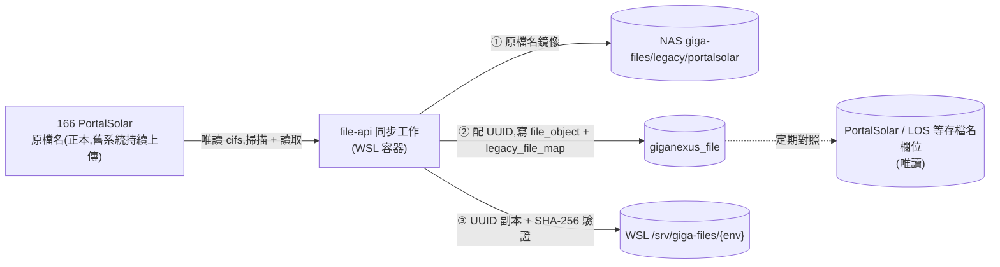

# GigaNexus 附件服務 — 舊系統 UUID 對照、同步與搬遷

> 本文件自 [PRD.md](PRD.md) §7 拆出(原 FILE-PLAN §10),為該主題的唯一維護來源;PRD 僅保留摘要與連結。
> 對應 PRD 版本:**v0.7**(2026-10-08)。相關決策:D8(對照表)、D9(舊服務不動)、D13(NAS 備份拉取)、D14(166 同步)。舊系統現況見 [LEGACY-INVENTORY.md](LEGACY-INVENTORY.md)。
> 所有舊來源(166、190 `SDSFILES`、NAS `CP` 與舊服務備份目錄)對本專案一律**唯讀**(`AGENT.md` §7.1)。

---

## 1. 原則與流程

1. **盤點**(F0):掃 `WebAppDb.webFileUpload`、`smbFileUpload`、PortalSolar 各表存檔名的欄位,以及 166 / 190 實際目錄,產出清單:檔案 ↔ 資料列、孤兒檔(有檔無資料)、斷鏈(有資料無檔)。
2. **對照**(F4):每個舊檔產生一筆 `legacy_file_map`(新 UUID + 原位置 + SHA-256,[DATABASE.md](DATABASE.md) §3),**舊資料表不動**。
3. **決策**:依盤點結果逐系統決定 ——(a)維持舊服務;(b)檔案搬進新服務、舊系統改讀新 API;(c)舊系統下線、只留唯讀查詢。
4. 搬遷時同名覆蓋(EHLicense)、孤兒檔、斷鏈須逐案處理,不自動合併。
5. **BPM 附件**:不搬、不對照(D10、D11),BPM 仍是附件的正本;Doid 本身是 BPM 的穩定識別,對外以 `/api/file/bpm/attachments/:doid` 存取。若之後採用快取(D11),快取的檔案才寫 `legacy_file_map`(`legacy_source = bpm`、`legacy_key = Doid`)。

## 2. NAS 備份拉取(D13,filebackend / SMBbackend)

兩個舊服務所在主機(10.10.130.122)已用批次檔(robocopy)把 files 目錄備份到 NAS `\\10.10.130.31\docker-folder`,所以**搬遷時不碰舊主機,直接從 NAS 拉**:

| 舊服務 | 來源目錄 | NAS 位置 |
| --- | --- | --- |
| filebackend | `D:\GeneralBackend\filebackend\files` | `docker-folder\`(根目錄,下面是 BPM / CRM / ERP / MES) |
| SMBbackend | `D:\GeneralBackend\SMBbackend\files` | `docker-folder\CP` |
| (知識庫,非本計畫) | `D:\GigaSolarKnowledgeBase\backend\uploads` | `docker-folder\KnowledgeBase` |

備份批次檔的特性(影響拉取做法):

1. 使用 `robocopy /is /e`:只新增 / 覆蓋,**不刪除**(沒有 `/mir`),所以 NAS 上的檔案是舊主機「曾經存在過」的聯集,可能含已被刪除的檔案;哪些是有效檔要以 `smbFileUpload` / `webFileUpload` 的 `Effective` 與資料列為準。
2. 備份是**時間點快照**:舊服務還在運作,拉取之後到切換之間的新上傳不在內;切換前必須再做一次差異同步(或先凍結舊服務上傳)。
3. 只有 robocopy log,沒有雜湊驗證;拉取時由 file-api 自己計算 SHA-256 並寫入 `legacy_file_map`。
4. SMB 目錄內有 `{uuid}{副檔名}` 與搬自舊主機的中文原檔名兩種,以 DB `path` 欄位對照。

做法:

- 新服務 WSL 的 cifs 掛載對 `CP`(及 filebackend 各平台目錄)**唯讀**;新服務的備份目錄 `giga-files/{env}/` 與它們分開,互不覆蓋(D6,[STORAGE.md](STORAGE.md) §2)。
- 拉取工具先「乾跑」:比對 NAS 檔案與 DB 資料列,輸出孤兒檔、斷鏈、重複、無法解析的名稱;確認後才實際複製進 `/srv/giga-files/{env}` 並產生 `file_object` / `legacy_file_map`。
- 舊檔是否沿用原 UUID(`/db/upload` 產生的檔名)或重新配發,留給 F4 決定。
- filebackend 量體小(151 筆、有效 103 筆,[LEGACY-INVENTORY.md](LEGACY-INVENTORY.md) §4.2),可一次完成;`webFileUpload` 的 `id` 寫入 `legacy_file_map.legacy_key`,供相容層的 `/sql-download/:id`、`/sql-delete/:id` 使用([API.md](API.md) §4.4 規則 2)。
- SMBbackend 量體小(83 筆、有效 54 筆,[LEGACY-INVENTORY.md](LEGACY-INVENTORY.md) §4.3),一次完成;其中 75 筆是原檔名、8 筆是 UUID 檔名,`legacy_file_map` 要記下舊 `path`,相容層才找得到舊檔([API.md](API.md) §4.4 規則 12)。
- 舊前端切換到相容層之前,該來源的歷史檔案必須已搬完並驗證([API.md](API.md) §4.4 規則 5)。

## 3. 166 PortalSolar 同步(D14)

166 的檔案**原檔名留在 166**,UUID 副本放 **WSL**,中間經 **NAS** 保存一份原檔名鏡像;新舊系統並行期間,166 仍是正本,同步為**單向**(166 → NAS → WSL),新系統自己上傳的檔案走 file-api,不寫回 166。

每個檔案走同一條狀態線(`sync_state`),每一步可重試、不重複做:

1. **掃描**:列出範圍內目錄的 (相對路徑, 大小, 修改時間),與 `legacy_file_map` 比對 —— 沒見過 = 新檔;大小或時間變了 = 內容可能被覆蓋;資料表有、166 沒有 = 標 `source_missing_at`(**不刪** NAS / WSL)。
2. **複製到 NAS**:保留原相對路徑與檔名,邊讀邊算 SHA-256;SHA 與現行列相同則只更新時間。
3. **配 UUID**:UUID 由應用端產生,寫 `file_object` 與 `legacy_file_map`。同名內容被覆蓋時,舊列 `is_current = 0` 保留(舊版 UUID 與 WSL 副本仍在),新增一列新 UUID。
4. **寫入 WSL**:自 NAS(或同次讀取的暫存)寫成 `{yyyy}/{mm}/{uuid}`,比對 SHA-256 後 `sync_state = done`;之後由 D6 的備份排程把 WSL 副本再備份到 `giga-files/{env}/`。
5. **對照資料庫**(只讀、只出報表):F0 盤點出的「存檔名欄位」逐筆比對 `legacy_file_map`,列出斷鏈(資料有、檔案無)與孤兒(檔案有、沒人引用);**不修改任何舊資料**。

並行期間排程**每日增量**(夜間,先看大小 + 修改時間,不變的檔案不重算 SHA、不重讀內容);大型目錄(例 `ESLearning` 影片)限速或獨立排程。第一次為全量。

切換:公告日 → 凍結 166 上傳 → 最後一輪同步 → 比對檔案數 / 容量 / SHA-256 → 新入口網改讀 UUID → 166 轉唯讀保留。

安全:同步只**讀** 166,使用**唯讀**服務帳號;帳號密碼放主機機密設定(`.env`,不進 git),由使用者以腳本寫入,AI 不經手([DEPLOYMENT.md](DEPLOYMENT.md) §5)。

待確認:同步目錄範圍、同名覆蓋處理、每日增量時段、切換日與凍結方式(PRD §11 #12、#13),**未定案前不擴大範圍**。
